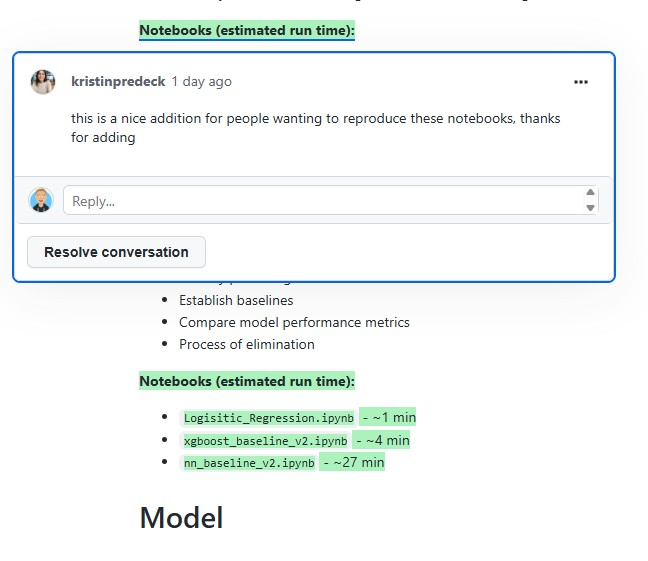
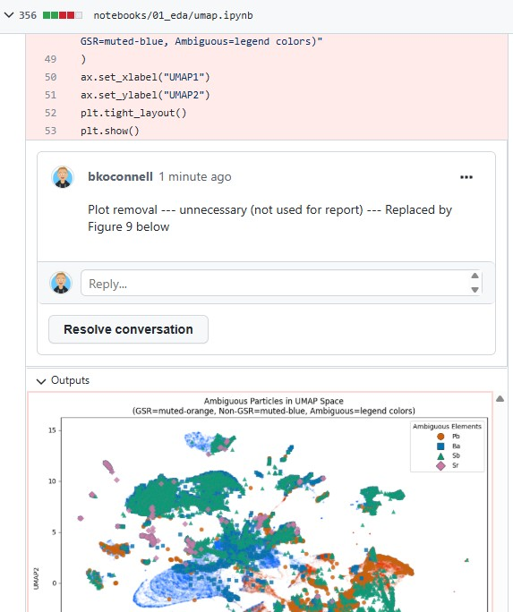
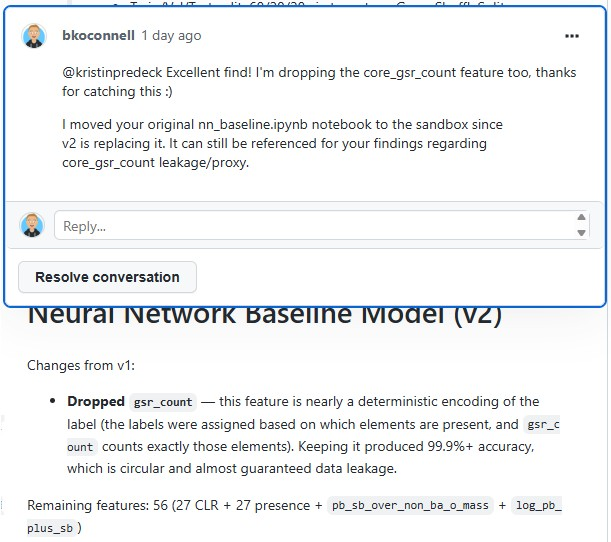
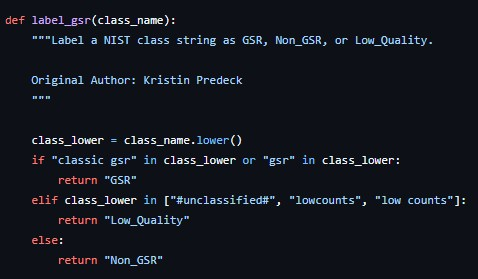
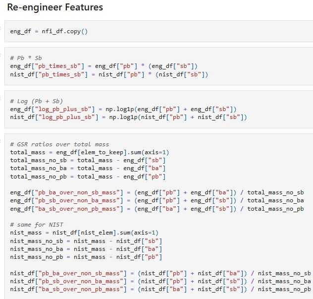
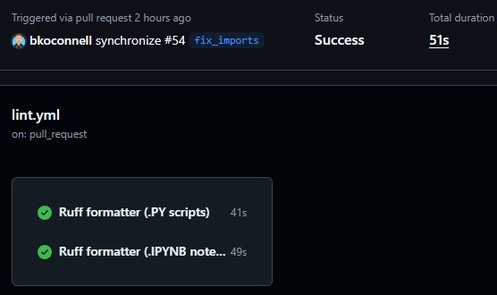
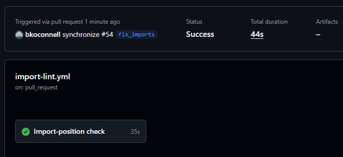
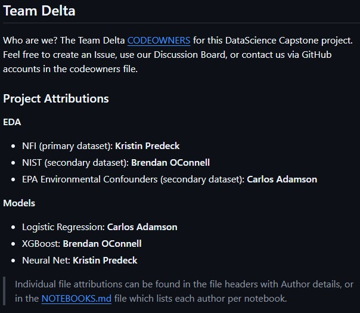
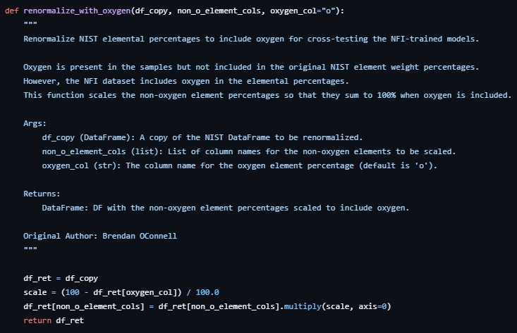
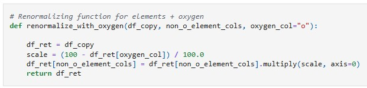

Our **CONTRIBUTING** document outlines the following:
- [Best Practices](#best-practices)
- [Contributing Guidelines](#contributing-guidelines)

---

# Best Practices

The following matrix illustrates how our project implementations align with best practice requirements.


| Best Practice Criteria | Our Repo? | Team Delta's Implementation | Example(s) if applicable |
|---|---|---|---|
| Annotated Code | ✅ | We have extensive markdown annotations throughout our notebooks describing our code | [Notebook for Logistic Regression Model](https://github.com/bkoconnell/datascience-capstone/blob/main/notebooks/04_model/HP_Logistic_Regression.ipynb) - descriptive markdown annotations |
| Code Reviews | ✅ | Our Pull Request process ensures we have the opportunity to review each other's contributions and provide constructive feedback. Each comment is directly linked to the user who posted it and we have the ability to suggest real-time code changes or request reviews. We specifically incorporated **GitNotebooks** which links directly to our PR's in GitHub and visually displays our IPYNB notebooks (where GitHub lacks this ability). This process is more conducive to interpretable reviews, whereas GitHub's raw JSON diffs are too cryptic for effective code reviews. | 1) [PR-54 CodeReview](https://app.gitnotebooks.com/bkoconnell/datascience-capstone/pull/54)</br></br>2) PR-47 GitNotebook comment screenshot|
| Assignment Delegation | ✅ | Our repository's README has as "Project Attributions" section that defines which EDA and Model assignments each team member was assigned. Our `notebooks/` directory is subdivided by DataFlow process steps, and each notebook within those are named according to the EDA or Model assignment they correspond to. Our NOTEBOOKS markdown file also provides an overview of this structure with assignment details. | 1) [Project Attributions for high-level assignment delegation](https://github.com/bkoconnell/datascience-capstone#project-attributions)<br/></br> 2) [NOTEBOOKS.md](https://github.com/bkoconnell/datascience-capstone/blob/main/notebooks/NOTEBOOKS.md) with team member delegation per notebook |
| Readability: Well-organized code | ✅ | Our notebooks are thoughtfully organized with a flow that reflects pertinent details in order of execution. We utilize GitNotebooks for code reviews and provide constructive feedback in areas where we feel irrelevant or distracting code should be removed | 1) [NN Baseline Model notebook - Readability/Well Organized](https://github.com/bkoconnell/datascience-capstone/blob/main/notebooks/03_model_exploration/nn_baseline_v2.ipynb)</br></br>2) **GitNotebooks** comment for removal of unused code/plot |
| Readability: Move unused code | ✅ | We have a dedicated `notebooks/` subdirectory called `99_sandbox` where we move unused or older versions of notebooks, or one-off exploratory deadends, to avoid cluttering our main notebook pipeline. These are mostly kept for traceability and historical context. | 1) [99_sandbox](https://github.com/bkoconnell/datascience-capstone/tree/main/notebooks/99_sandbox) subdirectory</br></br>2) GitNotebook comment for moving items to sandbox:   |
| Readability: Variable/Function naming | ✅ | Our variable and function naming is always thoughtful and relavant without being excessively long. | 1) Function naming </br></br>2) Variable naming  | 
| Readability: Code Flow & Logic | ✅ | We prioritize the flow of our code. It is well organized, formatted, and follows the story of our process through the DataScience Flow stages. The code is explanatory on its own, but we do include annotations to clarify key decisions and insights. | [Logistic Regression validation notebook](https://github.com/bkoconnell/datascience-capstone/blob/main/notebooks/06_validation/logistic_regression_nist_validation.ipynb) - Clean & logical code flow with meaningfully placed annotations |
| Code Best Practice: Python Formatting | ✅ | All our PY scripts and IPYNB notebooks adhere strictly to Python formatting standards. We use custom **linting** scripts that leverage the `ruff` library to ensure that all contributions meet the Python formatting standards. We run linting scripts locally, but also have automated CI workflows in GitHub for our PRs to ensure that we don't merge any PRs to our main branch until the linting checks have passed. | 1) [Custom linting scripts utilizing Ruff format tool](https://github.com/bkoconnell/datascience-capstone/tree/main/src/scripts/linting)</br></br>2) [Custom GH Actions / format-linting workflows](https://github.com/bkoconnell/datascience-capstone/blob/main/.github/workflows/lint.yml)  |
| Code Best Practice: Import Statements | ✅ | We have another custom script that reviews all our PY files and IPYNB notebooks to confirm that all libraries/packages are imported prior to any coding. The only allowable content prior to import statements is Docstrings and Markdown cells in notebooks, which are necessary for detailing the Author, purpose, and usage of the particular script or notebook. This script has also been incorporated into our GitHub CI workflow along with the linting/format checks. | 1) [Custom import-lint script](https://github.com/bkoconnell/datascience-capstone/tree/main/src/scripts/linting/import_lint.py)</br></br>2) [Custom GH Actions / import-linting workflow](https://github.com/bkoconnell/datascience-capstone/blob/main/.github/workflows/import-lint.yml) |
| README: Authorship | ✅ | Our repository's README has as link to our CODEOWNERS file which lists each team member. It also has a "Project Attributions" section that defines at a high level which assignments each team member worked on. Our NOTEBOOKS markdown file (the 'readme' for our `notebooks/` section) lists each notebook name and the Author credited for that notebook. | 1) Team Delta CODEOWNERS/Attributions</br></br>2) [NOTEBOOKS.md](https://github.com/bkoconnell/datascience-capstone/blob/main/notebooks/NOTEBOOKS.md) with team member delegation per notebook |
| README: Project Details / Overview | ✅ | The repository README has sections specifically related to project background, research questions, hypotheses/predictions, stakeholders, data & methods which include details about our model selections, our tech stack, testing & source code, repository structure, and the project timeline. | [README Table of Contents](https://github.com/bkoconnell/datascience-capstone#table-of-contents) |
| README: Custom Functions | ✅ | The "Testing & Source Code" section of our README highlights our `src/` directory which includes reusable custom functions. Each module has header docstrings that detail authorship, purpose, and usage among other things. The custom functions also have their own docstrings with additional information (usage / args / etc.) | 1) [SOURCE.md](https://github.com/bkoconnell/datascience-capstone/blob/main/src/SOURCE.md)</br></br>2) [src/utils/](https://github.com/bkoconnell/datascience-capstone/blob/main/src/utils) |
| README: Reproducibility | ✅ | Our README starts off with a QuickStart guide that streamlines the navigation of our repository in a way that facilitates even a first-time user to be running our code and repating our analysis in just 7 steps! **But wait, there's more!** A bonus step is included for anyone that wants to run our unit test suite for the custom functions. | [docs/QuickStart.md](https://github.com/bkoconnell/datascience-capstone/blob/main/docs/QuickStart.md) |
| Custom Functions | ✅ | As previously noted, we implemented custom functions throughout our notebooks, but for convenience of review (and for future reusability of code) we have rewritten many of these custom functions in our `src/utils/` directory, and we have a full unit test suite to show they function. Each function has a docstring that defines its purpose and usage, and it can be linked back to an originating notebook. | 1) [src/utils/](https://github.com/bkoconnell/datascience-capstone/blob/main/src/utils)</br></br>2) [Notebook implementation](https://github.com/bkoconnell/datascience-capstone/blob/main/notebooks/99_sandbox/validation/renormalize_NIST_oxygen.ipynb) |
| Testing / Validation / Reproducibility (self-tested) | ✅ | Each team member has tested and validated their own code. We also have a `validate` script that is manually run with a report on each notebook's reproducibility. And each model has a model test with results to demonstrate the current state of the model. | TODO: Screenshot of `validate` results and link to each model test results  |
| Testing / Validation / Reproducibility (user-tested) | ✅ | All of the self-testing functionality that we have locally is also available in our CI workflow in GitHub. Any user can run the tests there to get results. Or, they can follow the steps in the QuickStart guide to run the linting, validation, model, and unit tests locally. | TODO: Link to CI results for validate & model tests |
| Rendered Documents / Reports | ✅ | Our `artifacts/` directory contains our official reports & presentation for our stakeholder, NIJ, which are all rendered as PDF's. We also have our final models and our data dictionaries in the `artifacts/` directory. | [artifacts/](https://github.com/bkoconnell/datascience-capstone/tree/main/artifacts) |

---

# Contributing Guidelines

Below are guidelines for users to follow when contributing to our GitHub project.

The following assumptions are made:

- You have already cloned this repository locally. If not, see [CLONING.md](https://github.com/bkoconnell/datascience-capstone/blob/main/docs/CLONING.md)
- You have a supported version of Python installed. If not, see [python_setup.md](https://github.com/bkoconnell/datascience-capstone/blob/main/docs/python_setup.md)

## Branching and Pull Request Workflow

This project uses a simple branch-and-PR workflow. All changes go through a pull request before merging into `main`. This keeps `main` stable and gives the team a chance to review each other's work.

### Overview

1. Pull the latest `main`
2. Create a new branch
3. Make changes, commit, and push
4. Open a pull request (PR)
5. Keep committing and pushing to your branch as needed (the PR updates automatically)
6. Before merging, update your branch with the latest `main`
7. Merge your PR
8. Start your next task on a new branch or continue on your current one (after syncing with `main`)

---

## Quick Reference

| Step | GitHub Desktop | CLI |
|------|----------------|-----|
| Pull latest main | Switch to main, Fetch origin, Pull origin | `git checkout main && git pull origin main` |
| Create branch | Branch dropdown > New Branch | `git checkout -b branch-name` |
| Commit changes | Write summary, click Commit | `git add . && git commit -m "message"` |
| Push to remote | Click Push origin | `git push origin branch-name` |
| Open PR | Click Create Pull Request | `gh pr create --base main` |
| Update branch from main | Branch > Update from Default Branch | `git fetch origin && git merge origin/main` |
| Merge PR | On github.com, click Merge pull request | `gh pr merge --merge` |

---

### Step-by-Step

#### 1. Start from the latest main

Before creating a branch, make sure you have the most recent version of `main`.

**GitHub Desktop:**
- Make sure "main" is selected as your current branch (top of the window)
- Click "Fetch origin" then "Pull origin"

**CLI:**
```bash
git checkout main
git pull origin main
```

#### 2. Create a new branch

Keep branch names simple, like using your first name in lowercase (e.g., `kristin`, `brendan`, `carlos`). If you want to be more specific you can add a short description (e.g., ``kristin_nnmodel`, `brendan_eda`, `carlos_xgboost`).

**GitHub Desktop:**
- Click the current branch dropdown at the top
- Click "New Branch"
- Type your branch name and make sure it's based on `main`
- Click "Create Branch"

**CLI:**
```bash
git checkout -b your-branch-name
```

#### 3. Make changes, commit, and push

Work on your files as normal. When you're ready to save a checkpoint, commit your changes and push them to GitHub.

**GitHub Desktop:**
- Your changed files will show up in the left panel
- Write a short summary of what you did in the "Summary" box at the bottom left
- Click "Commit to [your-branch-name]"
- Click "Push origin" (or "Publish branch" if this is your first push on a new branch)

**CLI:**
```bash
git add .
git commit -m "short description of what you changed"
git push origin your-branch-name
```

#### 4. Open a pull request

Once you've pushed at least one commit, open a PR on GitHub so the team can see your work.

**GitHub Desktop:**
- After pushing, click the blue "Create Pull Request" button (or go to Branch > Create Pull Request)
- This opens GitHub in your browser
- Set the base branch to `main` and the compare branch to your branch
- Add a title and a brief description of what you're working on
- Click "Create pull request"

**CLI / Browser:**
- Go to the repository on github.com
- You should see a banner saying your branch had recent pushes with a "Compare & pull request" button -- click it
- Set base to `main`, add a title and description, and click "Create pull request"

Or use the GitHub CLI:
```bash
gh pr create --base main --title "Your PR title" --body "Brief description"
```

#### 5. Keep working (optional)

You don't have to merge right away. You can keep making changes, committing, and pushing to your branch. The PR updates automatically with each push, and other team members can review your code in progress.

Just repeat Step 3 as many times as you need.

#### 6. Update your branch with the latest main

Before merging your PR, pull in any changes that others have merged into `main` since you started your branch. This avoids merge conflicts and makes sure your code works with the latest version of everything.

See [Updating Your Branch with Latest Main](#updating-your-branch-with-latest-main) below for detailed instructions.

#### 7. Merge your PR

Once your branch is up to date with `main` and you're happy with your changes, merge the PR.

**Browser:**
- Go to your PR on github.com
- Click the green "Merge pull request" button
- Click "Confirm merge"

**CLI:**
```bash
gh pr merge --merge
```

#### 8. Start your next task

After merging, you have two options:

**Option A: Create a new branch** (recommended for a new task)

Follow Steps 1 and 2 again -- pull the latest `main` and create a new branch.

**Option B: Keep working on your current branch** (if continuing the same work)

Update your branch with the latest `main` first (see below), then keep going.

---

## Updating Your Branch with Latest Main

This is something you should do regularly, especially before merging a PR. It pulls in any changes that teammates have merged into `main` so your branch stays current.

### GitHub Desktop

1. Make sure your working branch is selected (not `main`)
2. Click "Fetch origin" in the top bar to download the latest remote changes
3. Go to Branch > Update from Default Branch (or Branch > Merge into Current Branch and select `origin/main`)
4. If there are conflicts, GitHub Desktop will walk you through resolving them
5. After the merge, click "Push origin" to push the updated branch to GitHub

### CLI

```bash
# Make sure you're on your working branch
git checkout your-branch-name

# Fetch the latest changes from the remote
git fetch origin

# Merge the latest main into your branch
git merge origin/main
```

If there are merge conflicts, git will tell you which files need attention. Open those files, resolve the conflicts (look for the `<<<<<<<`, `=======`, `>>>>>>>` markers), then:

```bash
git add .
git commit -m "resolved merge conflicts with main"
git push origin your-branch-name
```