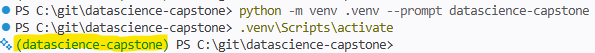

# Developer Setup

This guide provides the steps for setting up your local clone of the repository so that the [src/](../src/) and [tests/](../tests/) directories can be leveraged for notebooks and scripts. It also ensures that notebooks can be re-run with the proper dependencies without altering your global Python packages. 

### Prerequisites

Make sure you already ...

1. **Cloned the repository** to your local machine (see [CLONING.md](CLONING.md))
2. **Have a supported version of Python installed** (see [python_setup.md](python_setup.md))

> All commands below assume your terminal's current working directory is the project root (`datascience-capstone/`).

---

## 1. Create a Python Virtual Environment

A virtual environment ("venv") gives the project an isolated Python install so its dependencies don't collide with other projects or your global Python installation.

From the project root, create a venv named `.venv` (or a similar variation):

**Windows (PowerShell):**
```powershell
python -m venv .venv --prompt datascience-capstone
```

**macOS / Linux:**
```bash
python3 -m venv .venv --prompt datascience-capstone
```

This creates a `.venv/` folder in the project root. It is already listed in `.gitignore` and will not be committed. 

The `--prompt` option will take effect after the activation step.

### Activating the venv

You must activate the venv every time you open a new terminal session for this project.

**Windows (PowerShell or Command Prompt):**
```powershell
.venv\Scripts\activate
```

**macOS / Linux:**
```bash
source .venv/bin/activate
```

Confirm that your shell prompt is now prefixed with `(datascience-capstone)`:



> **VS Code tip:** open the Command Palette (`Ctrl+Shift+P` / `Cmd+Shift+P`), run "Python: Select Interpreter", and pick the one inside `.venv/`. VS Code will then auto-activate the venv for new terminals and use it as the kernel for notebooks.

### Deactivating the venv

When you're done working, you can leave the venv with:

```bash
deactivate
```

>This command is for reference purposes. You should keep your venv **activated** for the remainder of the steps.

---

## 2. Install Project Dependencies

With the venv activated, upgrade `pip` and install the dependencies pinned in [requirements.txt](../requirements.txt):

```bash
python -m pip install --upgrade pip
pip install -r requirements.txt
```

This installs the required Python packages such as `pandas`, `numpy`, `scikit-learn`, `xgboost`, `torch`, `pytest`, `ruff`, and the rest of the project's runtime and test dependencies.

---

## 3. Install the Project as an Editable Package (Optional)

The [pyproject.toml](../pyproject.toml) file configures the `src/` directory as an installable package. Installing it in **editable mode** (`-e`) lets notebooks and scripts import from `src/` directly, and any edits you make to `src/` take effect immediately without reinstalling.

> **Consequences of skipping this step:** Unit tests will fail and `src/` code cannot be imported into Notebooks (or *anywhere* outside of the `src/` directory.)

From the project root (still with the venv activated):

```bash
pip install -e .
```

You can confirm it worked by running:

```bash
python -c "from src.utils.fileops import load_data_file; print(load_data_file)"
```

If this prints a function reference (rather than an `ImportError`), the package is wired up correctly.

---

## Example: Using `src` in a Notebook

Once setup is complete, you can import utilities from `src/` in any notebook under [notebooks/](../notebooks/). The [`load_data_file`](../src/utils/fileops.py) helper takes just a filename - it recursively searches the project's `data/` directory for a match, so you don't need to pass a path.

Create a new notebook (e.g. `notebooks/99_sandbox/example_load.ipynb`) and add the following cell:

```python
from src.utils.fileops import load_data_file

# Pass just the filename and `load_data_file` finds it under `data/` for you.
df = load_data_file("particle_labeled.parquet")

df.head()
```

Run the cell to confirm.

**NOTE:** If a file with the same name exists in multiple subdirectories under `data/`, pass a relative path instead (e.g. `"processed/particle_labeled.parquet"`).

---

## Why a Virtual Environment is Recommended

Using a Python virtual environment is strongly recommended (rather than installing dependencies into your global system Python) for a few reasons:

- **Isolation** - this project's dependencies stay separate from other projects and your system Python, so version conflicts (e.g. one project needs `pandas 1.x`, another needs `pandas 2.x`) don't break anything.
- **Reproducibility** - every developer on the team works from the same `requirements.txt`, which makes it much easier to reproduce results and debug environment-specific issues.
- **Easy reset** - if your environment ever gets into a bad state, you can simply delete the `.venv/` folder and recreate it from scratch in seconds, without touching your system Python.
- **Safer experimentation** - installing or upgrading a package only affects this project, so you can try things out without risking your global Python setup.
