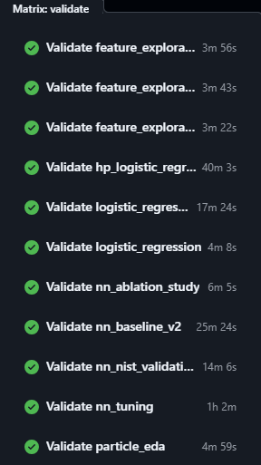
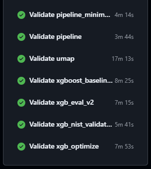

# Notebook Validation Workflow (GitHub Actions)

Executes the main data-science-flow notebooks end to end with `papermill` to verify each one runs without errors. Manual dispatch only.

| Workflow | File | Job |
|---|---|---|
| `nb-validate` | [`.github/workflows/nb-validate.yml`](../../.github/workflows/nb-validate.yml) | `validate` (matrix, one job per notebook) |

Each matrix entry runs one notebook on its own runner. Jobs run concurrently and are independent, so a failure in one does not cancel the others. The set of notebooks under validation is defined in the `matrix.include` block and tracks the main DS flow listed in [notebooks/NOTEBOOKS.md](../../notebooks/NOTEBOOKS.md). Supplementary notebooks (presentation, sandbox) are intentionally excluded.

Each job uploads an artifact named `nb-validate-<slug>` containing the Markdown report written by [`src/scripts/validation/nb_validate.py`](../../src/scripts/validation/nb_validate.py). Artifacts are uploaded whether the notebook passed or failed, so the executed-notebook report is always available to download.

## How to trigger

1. Open the repo on GitHub and click the **Actions** tab.
2. In the left sidebar, click **nb-validate**.
3. Click **Run workflow** in the upper right.
4. Pick the branch to run against and click the green **Run workflow** button.

The run appears at the top of the list within a few seconds. Click into it to watch progress.

## Estimate Run Times per Notebook





## How to view results

On the workflow run page:

- The job list shows one row per notebook with a green check or red x. Click any row to see its full log.
- The **Summary** at the top of each job shows a one-line PASS or FAIL line plus the notebook path. This is also surfaced in the run-level summary.
- The **Artifacts** section at the bottom of the run page lists one `nb-validate-<slug>` entry per job. Click the entry name to download a zip containing the Markdown validation report for that notebook.

The Markdown report includes the notebook path, status, duration, kernel, and (on failure) the failing cell index, exception type, and traceback.

## Fixing a failed `nb-validate` job

1. On the run page, download the `nb-validate-<slug>` artifact for the failing notebook.
2. Open the Markdown report. The "Error detail" section names the failing cell and shows the traceback.
3. Reproduce locally:

   ```bash
   python src/scripts/validation/nb_validate.py <path/to/notebook.ipynb>
   ```

4. Fix the notebook, commit, push, and re-run the workflow.

If the local run passes but CI keeps failing, the most common causes are:

- A data file is tracked in Git LFS but the notebook code reads it via a path that does not resolve on the runner. Confirm the file is pulled by the CI checkout (the workflow uses `lfs: true`).
- The notebook imports `src.*` modules and the runner has not installed the project. The workflow runs `pip install -e . --no-deps` in the install step, so check that step's log for errors.
- The notebook depends on a package not listed in `requirements.txt`.

## Adding or removing notebooks

Edit the `matrix.include` block in [`.github/workflows/nb-validate.yml`](../../.github/workflows/nb-validate.yml). Each entry has two fields:

```yaml
- name: <slug>
  notebook: notebooks/<path>.ipynb
```

The slug must be unique across the matrix because it becomes part of the artifact name. Use lowercase with underscores. The `notebook` path is case-sensitive on the Linux runner, so match the on-disk filename exactly.
