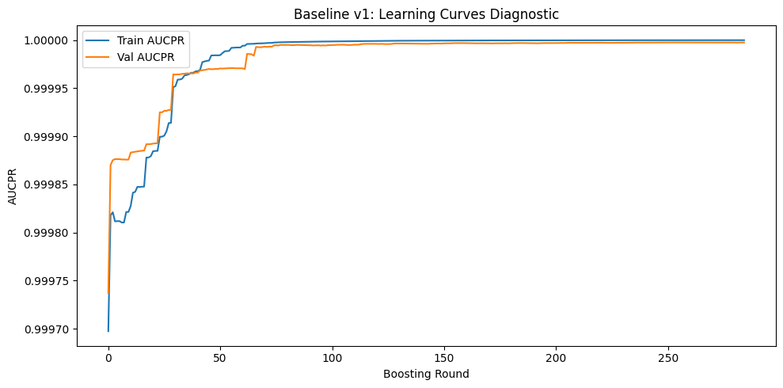
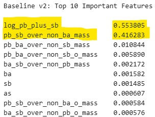
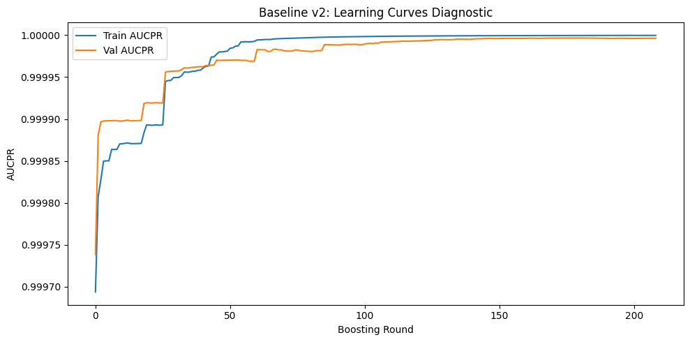

# XGBoost Baseline Models

### Evaluate engineered features for potential Feature Leakage or Label Proxy

1) __core_gsr_count__

Dropped from baseline model versions 2 & 3.

As seen in the learning curve below from XGBoost baseline model v1,
the learning curve starts at 0.9997 AUCPR on the very first boosting round and reaches 0.9999+ by round 50. 
The model essentially solves the problem immediately. The train and val curves track closely with no divergence, so there's no classical overfitting but that's because the task is too easy.

`core_gsr_count` accounts for 97.8% of all split importance. Suspect #1 for leakage. The model is almost entirely a single-feature decision tree that checks how many of Pb/Ba/Sb are present, with the remaining features handling a thin margin of edge cases (log_pb_plus_sb at 1.4% and everything else below 0.5%).

Feature Leakage or Label Proxy. The model learned the domain experts' rule in one split and barely needs anything else. It's not learning chemical relationships, it's learning a shortcut.

2) __log_pb_plus_sb__

Dropped from baseline model version 3.

3) __pb_sb_over_non_ba_mass__

Dropped from baseline model version 3.

4) __pb_sb_over_non_ba_o_mass__

Dropped from baseline model version 3 due to high redundancy of `pb_sb_over_non_ba_mass` which was dropped.
Highly likely that this one would simply replace the potential feature leakage / label proxy.